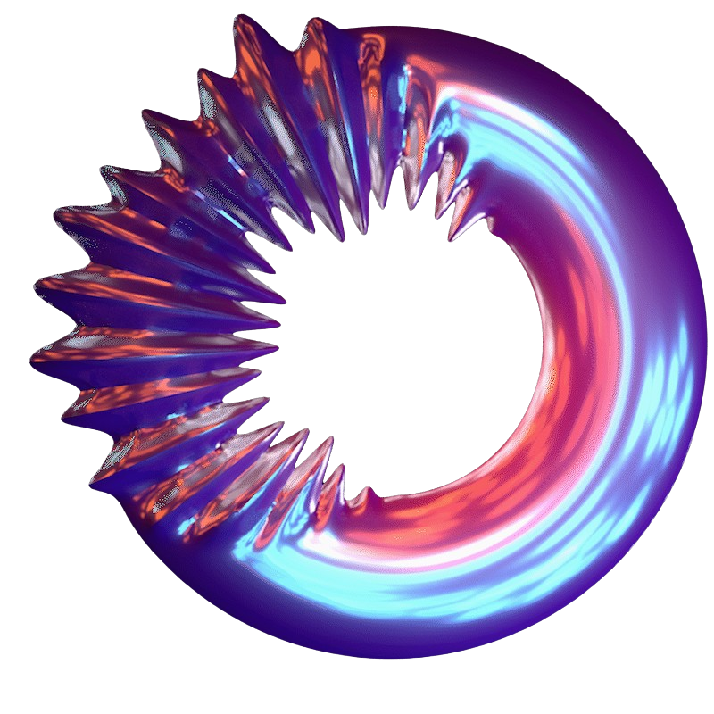

<h1 align='center'>OS-nixCfg</h1>

    
    

    

        
        
        
        
    

     

---
nix (via nix-darwin, nixos, nix-on-droid, home-manager, etc.) declarative configurations to attain my deterministically reproducible layer over the following OSes:

- macOS
- Android
- *nix (NixOS)
    - WSL