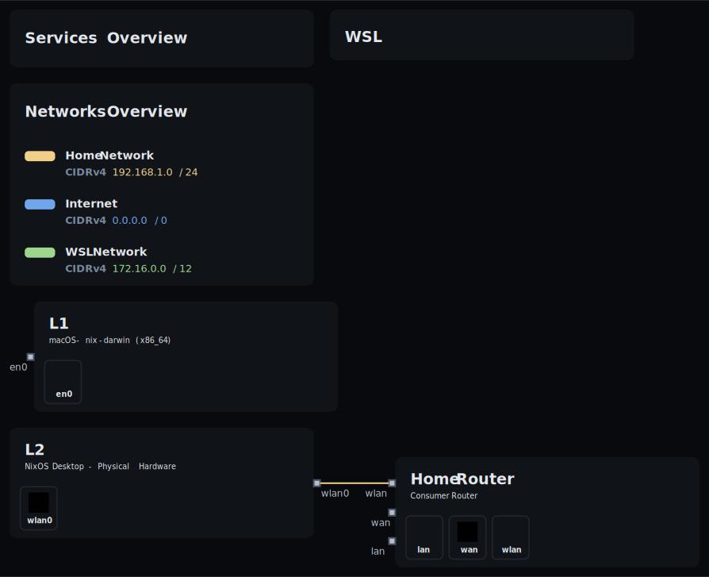
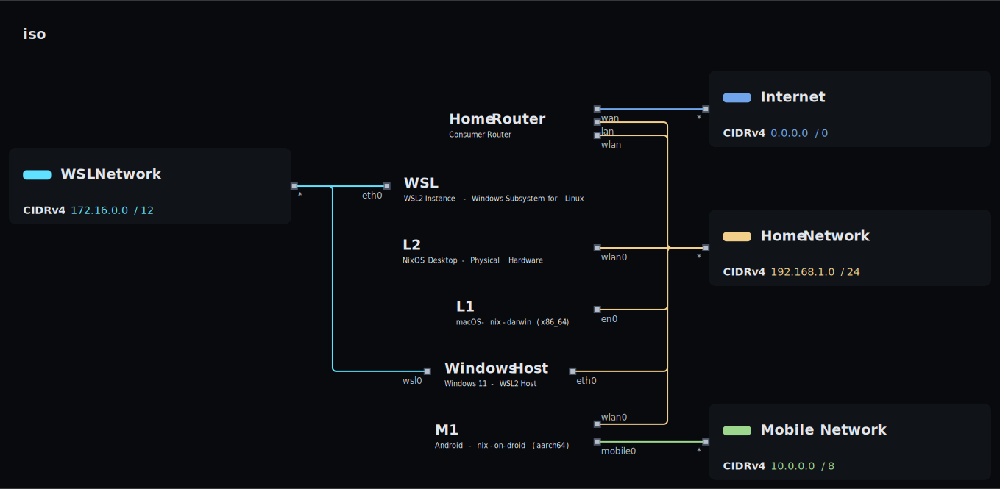

<div id="top">
    <div align="center">
        
        <h1 align='center'>OS-nixCfg</h1>
        <strong>My personal declarative Nix configurations for macOS, Android, and Linux (NixOS/WSL).</strong>
    </div>

</div>

---

<div align='center'>
    <a href="https://github.com/DivitMittal/OS-nixCfg/stargazers">
        
    </a>
    <a href="https://github.com/DivitMittal/OS-nixCfg/">
        
    </a>
    <a href="https://github.com/DivitMittal/OS-nixCfg/blob/main/LICENSE">
        
    </a>
    <a href="https://github.com/nixos/nixpkgs">
        
    </a>
    
</div>

---

<div align='center'>
    <a href="https://github.com/DivitMittal/OS-nixCfg/actions/workflows/flake-check.yml">
        
    </a>
    <a href="https://github.com/DivitMittal/OS-nixCfg/actions/workflows/home-build.yml">
        
    </a>
    <a href="https://github.com/DivitMittal/OS-nixCfg/actions/workflows/darwin-build.yml">
        
    </a>
    <a href="https://github.com/DivitMittal/OS-nixCfg/actions/workflows/nixos-build.yml">
        
    </a>
</div>

---

## Contents

- [Overview](#overview)
- [Project Structure](#project-structure)
- [Home Manager Profile Graph](#home-manager-profile-graph)
- [Network Topology](#network-topology)
- [Secrets Management](#secrets-management)
- [Related Repositories](#related-repositories)

---

## Overview

This repository contains primarily [nix](https://github.com/nixos/nix) configurations, leveraging [Nix Flakes](https://nixos.wiki/wiki/Flakes), [Home Manager](https://github.com/nix-community/home-manager), and system-specific modules ([NixOS](https://nixos.org/), [nix-darwin](https://github.com/LnL7/nix-darwin), [nix-on-droid](https://github.com/nix-community/nix-on-droid)) to achieve a purely declarative, reproducible, and consistent environment across multiple OSes on multiple hosts for multiple users:

- **macOS** (via `nix-darwin`)
- **Android** (via `nix-on-droid`)
- **\*nix (NixOS)** (including WSL via `NixOS-WSL`)

## Project Structure

The repository is organized using [flake-parts](https://github.com/hercules-ci/flake-parts) for better modularity.

```
.
├── .claude/                  # Claude AI assistant configuration
│   ├── commands/
│   │   └── openspec/
│   ├── .mcp.json
│   ├── CLAUDE.md
│   └── settings.json
├── .github/                  # GitHub Actions workflows & funding
│   ├── workflows/
│   └── FUNDING.yml
├── assets/                   # Images and visual assets
│   ├── topology/
│   │   ├── main.svg
│   │   └── network.svg
│   ├── home_graph.png
│   ├── qezta.gif
│   └── qezta.png
├── common/                   # Shared configurations across all platforms
│   ├── all/                  # Common to all configurations
│   ├── home/                 # Common home-manager configurations
│   └── hosts/                # Common host configurations
│       ├── all/
│       ├── darwin/
│       ├── droid/
│       ├── iso/
│       └── nixos/
├── flake/                    # Flake-parts module definitions
│   ├── actions/              # GitHub Actions definitions
│   ├── topology/             # Network topology configuration
│   ├── checks.nix
│   ├── devshells.nix
│   ├── formatters.nix
│   ├── iso-packages.nix
│   └── mkCfg.nix             # Universal host builder
├── home/                     # Home-manager modules by category
│   ├── comms/                # Communication (email, IRC, newsboat)
│   ├── dev/                  # Development tools (JS, Python, cloud)
│   ├── gui/                  # GUI applications and desktop managers
│   ├── media/                # Media tools (image, video, music)
│   ├── tools/                # Utilities (privacy, productivity, keyboard)
│   ├── tty/                  # Terminal tools (editors, shells, multiplexers)
│   └── web/                  # Web browsers and related tools
├── hosts/                    # Platform-specific host configurations
│   ├── darwin/               # macOS hosts (nix-darwin)
│   │   └── L1/
│   ├── droid/                # Android hosts (nix-on-droid)
│   │   └── M1/
│   ├── iso/                  # ISO configurations
│   │   ├── iso/
│   │   └── t2-iso/
│   └── nixos/                # NixOS hosts
│       ├── L2/
│       └── WSL/
├── lib/                      # Custom Nix utility functions
│   └── custom.nix
├── modules/                  # Custom NixOS/home-manager modules
│   ├── home/
│   └── hosts/
│       └── darwin/
├── openspec/                 # OpenSpec project documentation
│   ├── AGENTS.md
│   └── project.md
├── overlays/                 # Nix package overlays
│   └── custom.nix
├── pkgs/                     # Custom package derivations
│   ├── custom/               # Custom derivations
│   └── darwin/               # macOS-specific packages
├── templates/                # Nix flake templates
│   └── vanilla/
├── utils/                    # Build and rebuild scripts
│   ├── common.sh
│   ├── home_rebuild.sh
│   └── hosts_rebuild.sh
├── .editorconfig
├── .envrc
├── .gitattributes
├── .gitignore
├── AGENTS.md                 # AI agent instructions
├── CODEOWNERS
├── flake.lock
├── flake.nix                 # Main flake entry point
├── LICENSE
├── README.md
├── SECURITY.md
└── shell.nix
```

## Home Manager Profile Graph

This dependency graph visualizes the dependencies of the Home-Manager profile configuration:


## Network Topology

The network topology visualizations are automatically generated using [nix-topology](https://github.com/oddlama/nix-topology) and provide a comprehensive view of the infrastructure setup across all hosts and networks.

### Main Topology

Complete view of all nodes, networks, and their interconnections:



### Network View

Focused visualization of network segments and connectivity:



> **Note**: These topology diagrams are automatically built and updated via GitHub Actions whenever topology configurations.

## Secrets Management

Secrets (API keys, passwords, sensitive configurations) are managed via [agenix](https://github.com/ryantm/agenix) or specificaly [ragenix](https://github.com/yaxitech/ragenix).

1.  Secrets are encrypted using `ssh` keys. My public key is explicitly available to `ragenix`.
2.  The encrypted files reside in a **private** GitHub repository: `DivitMittal/OS-nixCfg-secrets`. This repository is referenced as a flake input.
3.  During the Nix build process, `agenix` decrypts these files using my private key.
4.  The decrypted files are placed in the Nix store & symlinked to their target locations.

⚠️ **Building this configuration requires access to the private `DivitMittal/OS-nixCfg-secrets` repo and the corresponding [age](https://github.com/FiloSottile/age) private `ssh` key.**

## Related Repositories

- [DivitMittal/ai-nixCfg](https://github.com/DivitMittal/ai-nixCfg): AI/LLM tool configurations extracted for modularity (CLI tools, cloud services, MCP servers, REPL configurations).
- `DivitMittal/OS-nixCfg-secrets`: (Private) Contains encrypted secrets managed by `agenix` & `ragenix`.
- [DivitMittal/Vim-Cfg](https://github.com/DivitMittal/Vim-Cfg): Pure lua standalone Neovim configuration, deployed via `nix4nvchad`.
- [DivitMittal/Emacs-Cfg](https://github.com/DivitMittal/Emacs-Cfg): An elisp doomemacs configuration, used as an input via `nix-doom-emacs-unstraightened`.
- [DivitMittal/TLTR](https://github.com/DivitMittal/TLTR): Cross-platform complex multi-layer keyboard layout tailored for programmers.
- [DivitMittal/hammerspoon-nix](https://github.com/DivitMittal/hammerspoon-nix): A nix home-manager module for hammerspoon & my hammerspoon lua configuration.
- [DivitMittal/firefox-nixCfg](https://github.com/DivitMittal/firefox-nixCfg): A personal nix home-manager module/configurations for firefox.
- [DivitMittal/tidalcycles-nix](https://github.com/DivitMittal/tidalcycles-nix): A nix flake for TidalCycles live coding environment.
- [DivitMittal/TermEmulator-Cfg](https://github.com/DivitMittal/TermEmulator-Cfg): Terminal emulator configuration.

<div align="right">

[![][back-to-top]](#top)

</div>

[back-to-top]: https://img.shields.io/badge/-BACK_TO_TOP-151515?style=flat-square&color=purple
