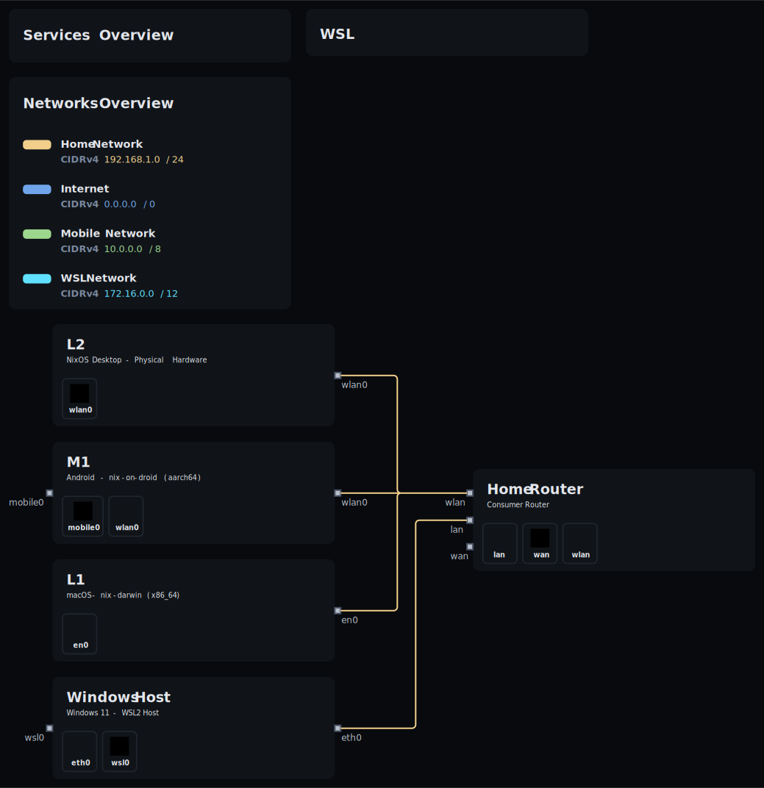
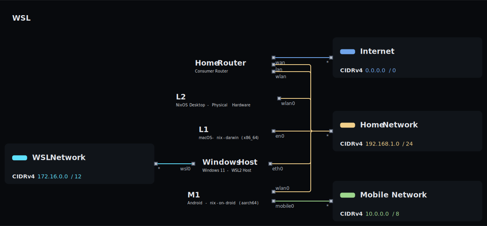

<div id="top">
    <div align="center">
        
        <h1 align='center'>OS-nixCfg</h1>
        <strong>My personal declarative Nix configurations for macOS, Android, and Linux (NixOS/WSL).</strong>
    </div>

</div>

---

<div align='center'>
    <a href="https://github.com/DivitMittal/OS-nixCfg/stargazers">
        
    </a>
    <a href="https://github.com/DivitMittal/OS-nixCfg/">
        
    </a>
    <a href="https://github.com/DivitMittal/OS-nixCfg/blob/main/LICENSE">
        
    </a>
    <a href="https://github.com/nixos/nixpkgs">
        
    </a>
    
</div>

---

<div align='center'>
    <a href="https://github.com/DivitMittal/OS-nixCfg/actions/workflows/flake-check.yml">
        
    </a>
    <a href="https://github.com/DivitMittal/OS-nixCfg/actions/workflows/home-build.yml">
        
    </a>
    <a href="https://github.com/DivitMittal/OS-nixCfg/actions/workflows/darwin-build.yml">
        
    </a>
    <a href="https://github.com/DivitMittal/OS-nixCfg/actions/workflows/nixos-build.yml">
        
    </a>
</div>

---

## Contents

- [📜 Overview](#-overview)
- [📁 Project Structure](#-project-structure)
- [📊 Home Manager Profile Graph](#-home-manager-profile-graph)
- [🗺️ Network Topology](#️-network-topology)
- [❄️Flake Inputs](#flake-inputs)
- [🔒 Secrets Management](#-secrets-management)
- [🔗 Related Repositories](#-related-repositories)

---

## 📜 Overview

This repository contains primarily [nix](https://github.com/nixos/nix) configurations, leveraging [Nix Flakes](https://nixos.wiki/wiki/Flakes), [Home Manager](https://github.com/nix-community/home-manager), and system-specific modules ([NixOS](https://nixos.org/), [nix-darwin](https://github.com/LnL7/nix-darwin), [nix-on-droid](https://github.com/nix-community/nix-on-droid)) to achieve a purely declarative, reproducible, and consistent environment across multiple OSes on multiple hosts for multiple users:

- 🍎 **macOS** (via `nix-darwin`)
- 🤖 **Android** (via `nix-on-droid`)
- 🐧 **\*nix (NixOS)** (including WSL via `NixOS-WSL`)

## 📁 Project Structure

The repository is organized using [flake-parts](https://github.com/hercules-ci/flake-parts) for better modularity.

```
.
├── .claude
│   └── settings.json
├── .github
│   ├── workflows
│   └── FUNDING.yml
├── assets
│   ├── topology
│   ├── home_graph.png
│   ├── qezta.gif
│   └── qezta.png
├── common
│   ├── all
│   ├── home
│   ├── hosts
│   └── README.md
├── flake
│   ├── actions
│   ├── topology
│   ├── checks.nix
│   ├── default.nix
│   ├── devshells.nix
│   ├── formatters.nix
│   ├── mkHost.nix
│   └── README.md
├── home
│   ├── ai
│   ├── comms
│   ├── dev
│   ├── gui
│   ├── media
│   ├── tools
│   ├── tty
│   ├── web
│   ├── default.nix
│   └── README.md
├── hosts
│   ├── darwin
│   ├── droid
│   ├── nixos
│   ├── default.nix
│   └── README.md
├── lib
│   ├── custom.nix
│   ├── default.nix
│   └── README.md
├── modules
│   ├── home
│   ├── hosts
│   ├── default.nix
│   └── README.md
├── overlays
│   ├── default.nix
│   ├── nixpkgs.nix
│   └── README.md
├── pkgs
│   ├── custom
│   ├── darwin
│   ├── pypi
│   └── README.md
├── templates
│   ├── vanilla
│   └── default.nix
├── utils
│   ├── common.sh
│   ├── home_rebuild.sh
│   └── hosts_rebuild.sh
├── .editorconfig
├── .envrc
├── .gitattributes
├── .gitignore
├── .mcp.json
├── .pre-commit-config.yaml
├── CLAUDE.md
├── CODEOWNERS
├── flake.lock
├── flake.nix
├── LICENSE
├── README.md
├── SECURITY.md
└── shell.nix

38 directories, 43 files
```

## 📊 Home-Manager Profile Graph

This dependency graph visualizes the dependencies of the Home-Manager profile configuration:


## 🗺️ Network Topology

The network topology visualizations are automatically generated using [nix-topology](https://github.com/oddlama/nix-topology) and provide a comprehensive view of the infrastructure setup across all hosts and networks.

### Main Topology

Complete view of all nodes, networks, and their interconnections:



### Network View

Focused visualization of network segments and connectivity:



> **Note**: These topology diagrams are automatically built and updated via GitHub Actions whenever topology configurations.

## ❄️Flake Inputs

This flake relies on several external inputs to manage dependencies and configurations:

- **Core & System:**
  - **`nixpkgs`**: The core Nix package set (tracking `nixpkgs-unstable`).
  - **`nixpkgs-master`**: Tracks the master branch of Nixpkgs (used occasionally).
  - **`systems`**: Provides standard system identifiers (e.g., `x86_64-darwin`).
- **Flake Helpers:**
  - **`flake-parts`**: Used for structuring the flake outputs with modularity.
  - **`flake-utils`**: General utilities for flakes.
  - **`devshell`**: Provides convenient development shells.
  - **`pre-commit-hooks`**: Manages Git hooks for code quality and formatting.
  - **`treefmt-nix`**: For code formatting integration.
- **OS Integration:**
  - **`home-manager`**: Manages user-level configurations and dotfiles.
  - **`nix-darwin`**: Enables declarative macOS system configuration.
  - **`nix-homebrew`**: For Homebrew package integration within `nix-darwin`.
  - **`nixos-wsl`**: Provides modules for running NixOS on WSL.
  - **`nix-on-droid`**: Enables declarative Android configuration via Termux fork.
- **Secrets Management:**
  - **`agenix`**: Base library for managing secrets declaratively via age encryption.
  - **`ragenix`**: Rust implementation/wrapper for `agenix`.
  - **`OS-nixCfg-secrets`**: **(Private Repository)** Contains encrypted secrets managed by `ragenix`.
- **Application/Tooling Specific:**
  - **`nix-index-database`**: Provides a database for `nix-index`.
  - **`Vim-Cfg`**: My external Neovim configuration repository (used as a source).
  - **`nvchad4nix`**: Integrates Neovim configurations (like NvChad or custom starters) with Home Manager.
  - **`kanata-tray`**: Provides a system tray application for managing Kanata keyboard remapping presets.
  - **`betterfox`**: Nix integration for Betterfox Firefox hardening.
  - **`brew-nix`**: Alternative Nix integration for Homebrew casks/formulae.
  - **`brew-api`**: Homebrew API data used by `brew-nix`.

_(See `flake.nix` for the complete list and specific sources/versions)_

## 🔒 Secrets Management

Secrets (API keys, passwords, sensitive configurations) are managed via [agenix](https://github.com/ryantm/agenix) or specificaly [ragenix](https://github.com/yaxitech/ragenix).

1.  Secrets are encrypted using `ssh` keys. My public key is explicitly available to `ragenix`.
2.  The encrypted files reside in a **private** GitHub repository: `DivitMittal/OS-nixCfg-secrets`. This repository is referenced as a flake input.
3.  During the Nix build process, `agenix` decrypts these files using my private key.
4.  The decrypted files are placed in the Nix store & symlinked to their target locations.

⚠️ **Building this configuration requires access to the private `DivitMittal/OS-nixCfg-secrets` repo and the corresponding [age](https://github.com/FiloSottile/age) private `ssh` key.**

## 🔗 Related Repositories

- `DivitMittal/OS-nixCfg-secrets`: (Private) Contains encrypted secrets managed by `agenix` & `ragenix`.
- [DivitMittal/Vim-Cfg](https://github.com/DivitMittal/Vim-Cfg): Pure lua standalone Neovim configuration, deployed via `nix4nvchad`.
- [DivitMittal/Emacs-Cfg](https://github.com/DivitMittal/Emacs-Cfg): An elisp doomemacs configuration, used as an input via `nix-doom-emacs-unstraightened`.
- [DivitMittal/TLTR](https://github.com/DivitMittal/TLTR): Cross-platform complex multi-layer keyboard layout tailored for programmers.
- [DivitMittal/hammerspoon-nix](https://github.com/DivitMittal/hammerspoon-nix): A nix home-manager module for hammerspoon & my hammerspoon lua configuration.
- [DivitMittal/firefox-nixCfg](https://github.com/DivitMittal/firefox-nixCfg): A personal nix home-manager module/configurations for firefox.
- [DivitMittal/TermEmulator-Cfg](https://github.com/DivitMittal/TermEmulator-Cfg): Terminal emulator configuration.

<div align="right">

[![][back-to-top]](#top)

</div>

[back-to-top]: https://img.shields.io/badge/-BACK_TO_TOP-151515?style=flat-square&color=purple
