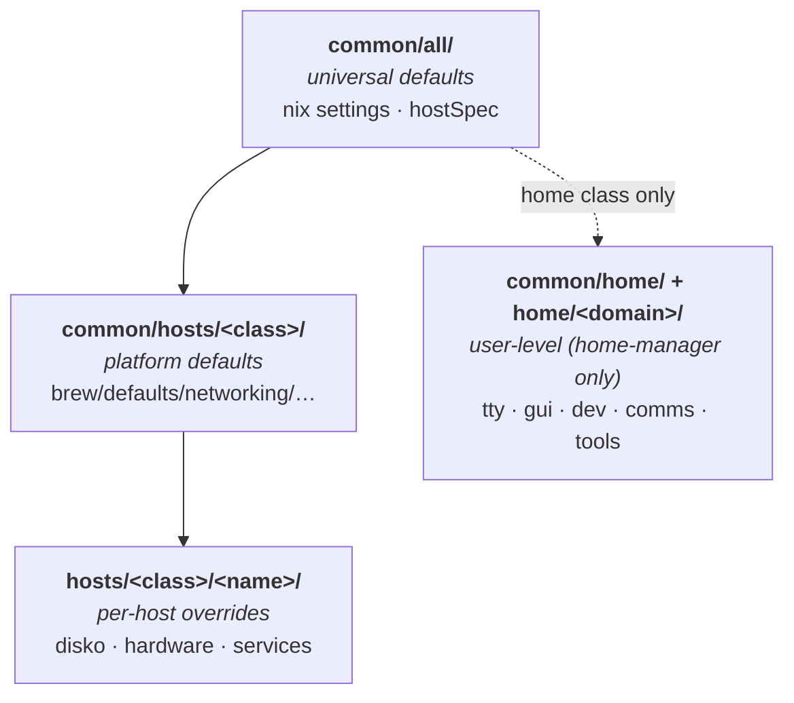

# Common Directory

Shared configurations applied to all hosts and users.

## Structure

```
common/
├── all/          # Universal configs for all platforms
├── home/         # Common home-manager configs
└── hosts/        # Common host/system configs
    ├── all/      # Universal host configs
    ├── darwin/   # macOS-specific
    ├── nixos/    # NixOS-specific
    ├── droid/    # nix-on-droid-specific
    └── iso/      # ISO build-specific
```

## Override Hierarchy

Modules compose top-down: each later layer can override earlier defaults via `lib.mkDefault` / `lib.mkForce`. The home layer applies only to home-manager configs (`class = "home"`); all other classes stop at the host layer.



| Layer                             | Applies to                                         | Examples                                                      |
| --------------------------------- | -------------------------------------------------- | ------------------------------------------------------------- |
| `common/all/`                     | every config (incl. droid via `hostSpec.nix` only) | nix daemon settings, garbage-collection, substituters         |
| `common/hosts/all/`               | every host (not home, not droid)                   | shells, users, system packages                                |
| `common/hosts/<class>/`           | one platform                                       | `darwin/brew.nix`, `nixos/networking.nix`, `droid/termux.nix` |
| `hosts/<class>/<name>/`           | one specific host                                  | `nixos/T2/disko.nix`, `darwin/L1/services/kanata.nix`         |
| `common/home/` + `home/<domain>/` | every home-manager config                          | shells, editors, prompts, GUIs                                |

## Usage

Common configs are automatically imported by `mkCfg` builder. Place widely applicable settings here; host-specific configs belong in `hosts/`.
