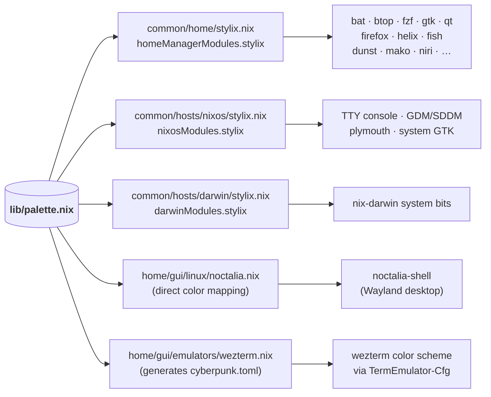

# Lib Directory

Custom library functions and shared data files used across the flake.

## Contents

```
lib/
├── custom.nix      # lib.custom.* helpers (mkZbxBin, mkUvxBin, mkPnpmDlxBin, scanPaths)
└── palette.nix     # Source-of-truth cyberpunk palette (base16 + fonts + opacity + wallpaper)
```

## `custom.nix` — helpers

Extends nixpkgs' `lib` via `flake.nix → specialArgs.lib`. Access at call sites as `lib.custom.<helper>`.

| Helper         | Purpose                                                                                                                      |
| -------------- | ---------------------------------------------------------------------------------------------------------------------------- |
| `mkZbxBin`     | Wrap a Homebrew formula in `pkgs.writeShellScriptBin` running it ephemerally via `zerobrew`. Darwin-only.                    |
| `mkUvxBin`     | Wrap a Python tool in `pkgs.writeShellScriptBin` running it ephemerally via `uv tool run`.                                   |
| `mkPnpmDlxBin` | Wrap a JS package in `pkgs.writeShellScriptBin` running it ephemerally via `pnpm dlx`.                                       |
| `scanPaths`    | Auto-import all `.nix` files in a directory (excluding `default.nix`). **Deprecated** — use `inputs.import-tree` everywhere. |

The first three are partially-applied with `pkgs` inside `flake/mkCfg.nix` so call sites only need to pass the formula/tool name and arguments.

## `palette.nix` — theme source of truth

A single attrset describing the entire visual identity. Imported by every themed module.

```nix
{pkgs}: rec {
  base16Scheme = { base00 = "000000"; … base0F = "b266ff"; };   # 16 hex strings
  opacity      = { terminal = 0.85; popups = 0.92; … };
  fonts        = { monospace = { package = …; name = "…"; }; … };
  wallpaper    = ../assets/pitch-black.png;
  polarity     = "dark";
}
```

### How the palette propagates



### Retuning the palette

Change a hex in `palette.nix` and rebuild — every consumer downstream updates. The one out-of-tree consumer is `TermEmulator-Cfg/wezterm/options.lua`, which references the scheme by name (`config.color_scheme = "cyberpunk"`) and only needs editing if `window_background_opacity` should mirror a changed `opacity.terminal`.
